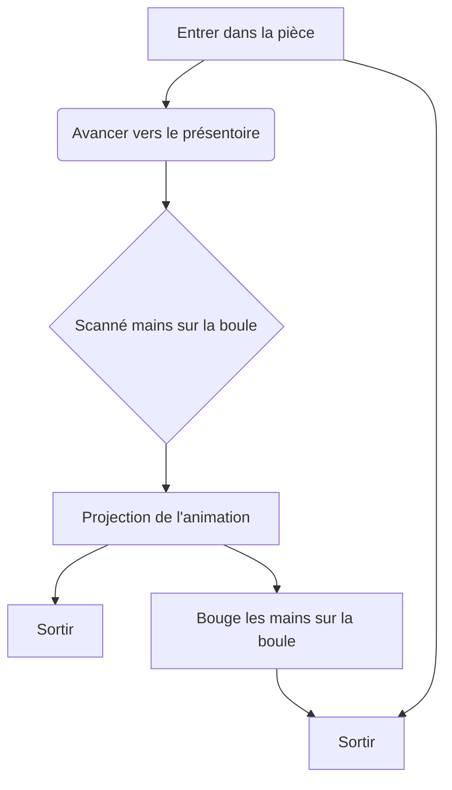

# Motus Animi (mouvements de l'esprit) - Sitmonternna Yi

## Idée générale
### Concept
Une immersion intéractive faite à l'aide de l'intelligence artificielle dans un dome accompagnée de musique et décoration lumineuse.

### Objectif
Ce projet vise à offrir aux visiteurs une interaction humaine enrichie par la technologie. Il s’agit également d’une activité conviviale pouvant rassembler de larges groupes, favorisant ainsi le renforcement des liens humains grâce à l’innovation technologique.

### Motivation créative
Ce projet a pour objectif de rassembler les proches tout en démontrant l'utilisation artistique de l'intelligence artificielle. Il cherche à dissiper les stéréotypes associés à l'IA, en montrant qu'elle peut enrichir les interactions humaines et favoriser des moments de partage et de connexion authentiques, même à l’ère numérique.

## Scénario 
### Logigramme de l'intéractivité

 

### Narratif
Il n' y a pas de trame narrative, le projet est une immersion intéractive dans un dome.

### Expérience de l' utilisateur
#### Installation de la Boule Interactif 
Les participants sont invités à s'approcher d'une boule lumineuse. En plaçant leurs mains dessus, elle déclenche un visuel unique.

#### Scanne 
La boule scannera leur battement de coeur, leur biométrie ainsi que leur température afin de personnaliser leur animation la boule émettera une lumière pour indiquer son processus.

#### Visualisation de l'Énergie 
À mesure qu'ils interagissent avec la boule, une animation générée par l’intelligence artificielle est projetter sur toute la pièce et les lumières changeront de couleurs aussi, représentant leur énergie sous forme de couleurs et  formes abstraites. Chaque interaction est différente, rendant chaque expérience personnelle et unique.

#### Intéractivité avec la boule
À mesure que les visiteurs bouge leur mains l' animation bougera et les couleurs de lumières changeront aussi.

## Ambiance - moodboard
### Moodboard visuelle

source images: https://www.lucent-design.co.jp/en/artworks/kaleido-circle/ 
               https://www.teamlab.art/fr/ew/spiral_fireonice/mifuneyama_lamp/
                
               https://meowwolf.com/?gad_source=1&gclid=Cj0KCQjwgL-3BhDnARIsAL6KZ6-_l05LL7f-E_inxbu-6laeTKFXHXHRIVCcIxjQvGWuGWk8kVr1d8EaAlh-EALw_wcB

### Moodboard sonore
[Sonore 1](https://pixabay.com/fr/music/meditation-spirituel-heavenly-energy-188908/)
 
[Sonore 2](https://pixabay.com/fr/music/ambiant-ambiant-relax-sounds-10621/)
 
[Sonore 3](https://pixabay.com/fr/music/ambiant-lost-in-the-forest-236236/)
 
[Sonore 4](https://pixabay.com/fr/music/meditation-spirituel-cave-of-solitude-187589/)

### Références artistiques

source images: https://www.lucent-design.co.jp/en/artworks/kaleido-circle/ 
               https://www.teamlab.art/fr/ew/spiral_fireonice/mifuneyama_lamp/

## Éléments et technologies nécessaire
### Support médiatique
Lumières 
 
Audio
 
Projection
 
Capteurs

### Matériel
Mini Heart Rate Unit (MAX30100) Pulse Oximeter
 
Ordinateur
 
Lumière en forme de chandelles
 
Projecteur
 
Haut-parleur
 
Capteur de lumière
 
Boule semi-transpararente
 
Capteur de température et d'humidité numérique
 
Lecteur d'empreinte digital

### Logiciels
Touch Designer
 
Arduino
 
Reaper

## Scénarimage / Simulation
### Visualisation des séquences
Présenter un scénarimage ou une simulation en 3D qui montre les principales étapes de l’expérience multimédia, du point de vue de l’utilisateur.
Illustrations des interactions
### Intégrer des visuels ou des captures d’écrans montrant comment l’installation réagit aux actions des utilisateurs.
### Évolution visuelle et narrative
Visualiser la progression de l'expérience en fonction des interactions utilisateurs.

## Synoptique
### Schéma technique
Créer un synoptique représentant les connexions entre les dispositifs (câblages, réseaux, signaux audio/vidéo, etc.).
Préciser les types de signal, les protocoles utilisés et la communication entre les dispositifs (OSC, MIDI, DMX, etc.).

### Flux de données
Décrire le cheminement des flux de données entre les différentes composantes de l’installation.

## Plantation
### Emplacement des dispositifs
Planifier la disposition des dispositifs multimédias dans l’espace (projecteurs, capteurs, caméras, haut-parleurs, etc.).
Justifier chaque emplacement en fonction des besoins techniques et des interactions utilisateurs.

### Circulation des visiteurs
Anticiper le mouvement des visiteurs et leur interaction avec les points d’interaction dans l’espace.

### Gestion des câblages
Préciser comment les câblages et connexions seront organisés pour assurer la sécurité et l’esthétique de l’installation.

## Anticiper les besoins matériels et logiciels
### Liste des équipements
Identifier les équipements nécessaires (projecteurs, serveurs, capteurs, dispositifs interactifs, etc.) et justifier leur choix en fonction des besoins du projet.

### Logiciels et réseaux
-Touch designer (Audio )
- Arduino
Préciser les logiciels et systèmes nécessaires au bon fonctionnement de l’installation (logiciels de projection, de traitement vidéo, gestion d’éclairage, etc.).
Décrire la gestion des réseaux et des systèmes de communication entre les différentes composantes.
