# Documentation de l'oeuvre numérique - Isochrone
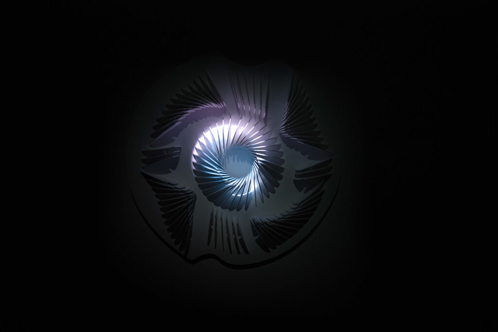
  
source photo : Rendez-vous Québec Cinéma,Cinémathèque Québécoise, Montréal (CA), 2020

## Équipe
Isochrone est une création numérique réalisée par Manuel Chantre du Studio Chantre, en collaboration avec Francis Tremblay, ainsi que le Cégep André-Laurendeau 
et soutenue financièrement par le gouvernement du Québec.

#### Concept, dessin technique paramétrique, production, ateliers 
 Manuel Chantre
 
#### Contribution visuel 
 Francis Tremblay

#### Équipe étudiante (sculpture)
 Sarra Boussoukaya
  
 Madouba Diallo 
  
 Maité Muriel Ingar Diaz 
  
 Diego Jacazio
  
 Nathalie Nguyen 
  
 Chloé Puigpinos 
  
 Francis Tremblay
 
#### Reconnaissance 
 Bruno Santerre et Gilbert Forest du cégep André-Laurendreandeau
  
 Olivier Toutiras Anaïs Beauchemin de la Maison de la Culture Marie-Uguay
  
 Olivier Heaps-Drolet
  
 Annie Lévesque 
  
 Patrick Akadji 
  
 Émilie Lévesque-Clément
 
## Date et endroit
 #### Maison de la cutlture Marie-Uguay (CA) 2019.
C'est un lieu qui offre des spectacles et des expositions gratuites, sauf indication contraire. Tout au long de l'année, il propose des événements permettant 
de découvrir des œuvres d'art uniques, ainsi que d'autres disciplines artistiques. 
  
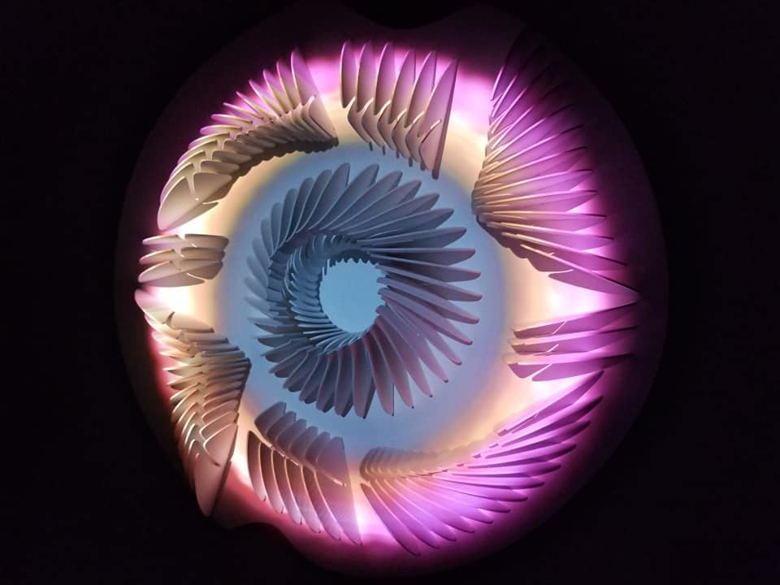 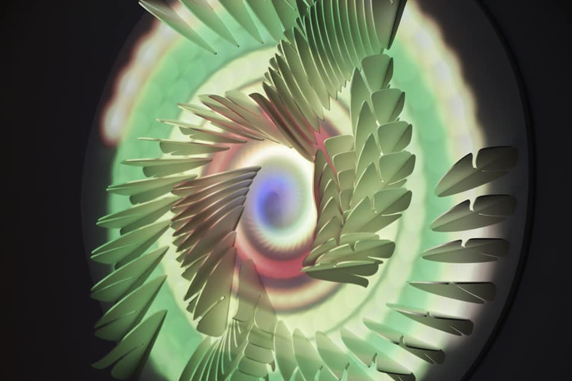
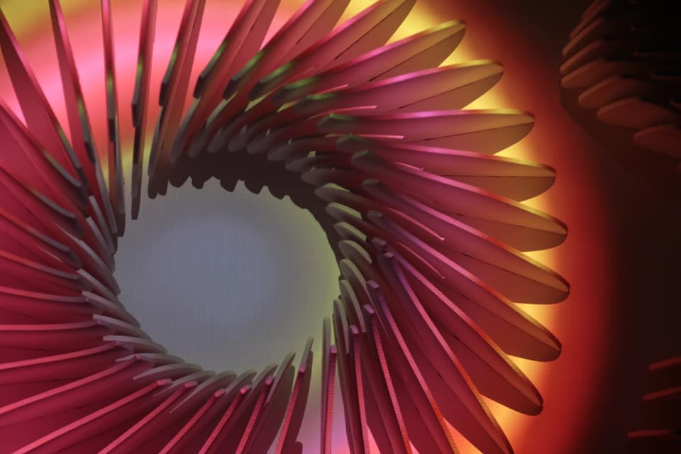 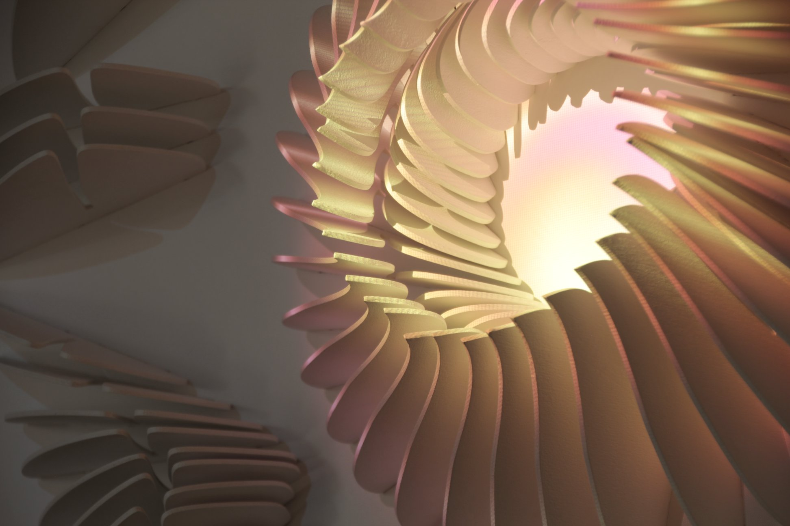
  
sources photos: https://www.facebook.com/creationsculpturevideo/?locale=mk_MK
 #### MAPP_MTL, Never Apart, Montreal (CA), 2019-2020 (sculpture I)
MAPP MTL transforme des espaces publics en lieux de liberté d'expression artistique en s'appuyant sur la projection mapping. Son objectif principal est de favoriser 
le développement de la projection mapping en partageant ces avancées avec les quartiers, afin de devenir le lien entre les artistes, les habitants et le quartier.
  
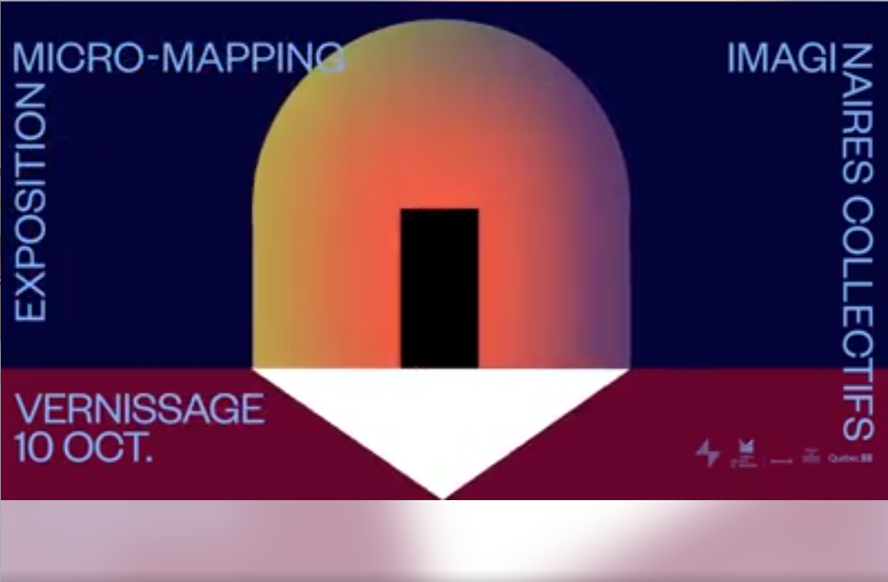
  
sources photos: https://www.facebook.com/creationsculpturevideo/?locale=mk_MK  

 #### Rendez-vous Québec Cinéma,Cinémathèque Québécoise, Montreal (CA), 2020
Un festival dédié exclusivement au cinéma, couvrant plusieurs genres et approches cinématographiques. Cette compagnie n'est pas entièrement focalisée sur le cinéma ;
elle propose également à ses visiteurs des événements gratuits liés à d'autres formes d'art, afin d'encourager les artistes dans leur démarche créative.

  
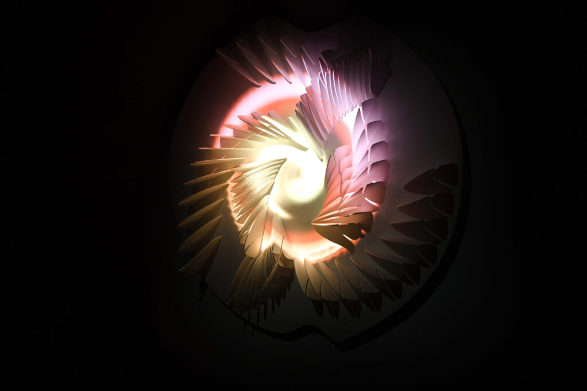 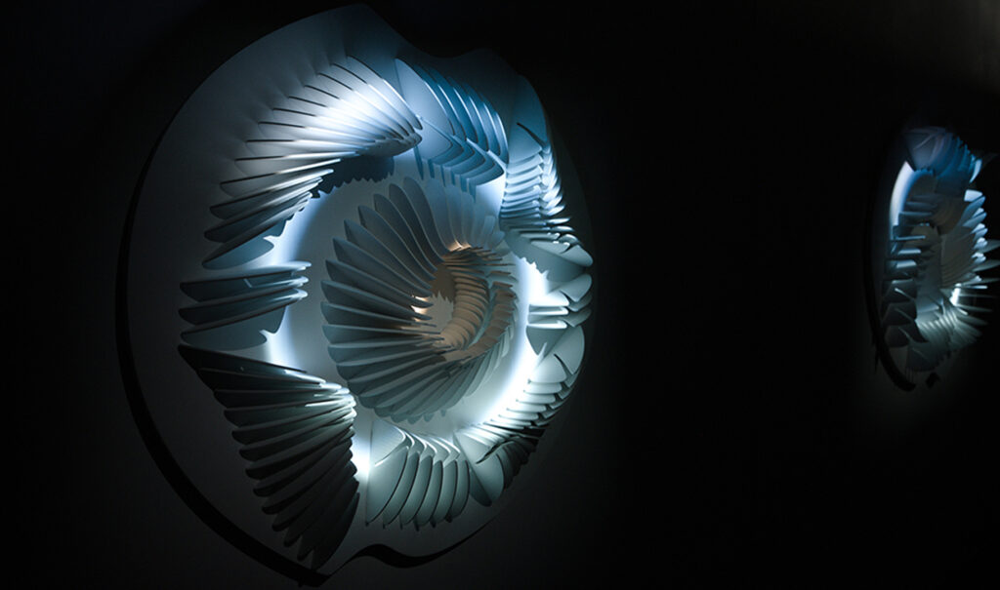
 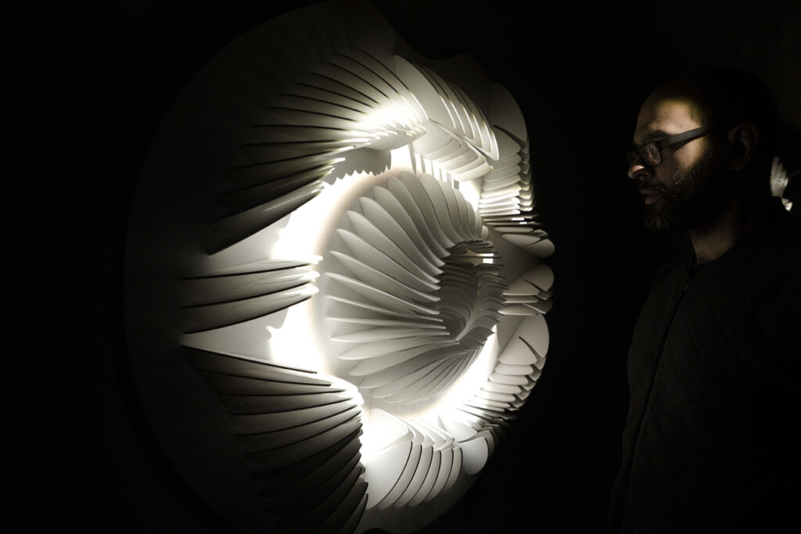
  
source photo : Rendez-vous Québec Cinéma,Cinémathèque Québécoise, Montréal (CA), 2020   

 #### Mutek, Village Numérique, Montreal (CA), 2024
C'est un parcours urbain où la technologie et la créativité s'unissent. À la tombée de la nuit, le Quartier des Spectacles se transforme en galerie d'art ouverte
au public. Les visiteurs peuvent admirer et interagir avec les arts numériques et découvrir de nouveaux mondes grâce à ces expériences.
   
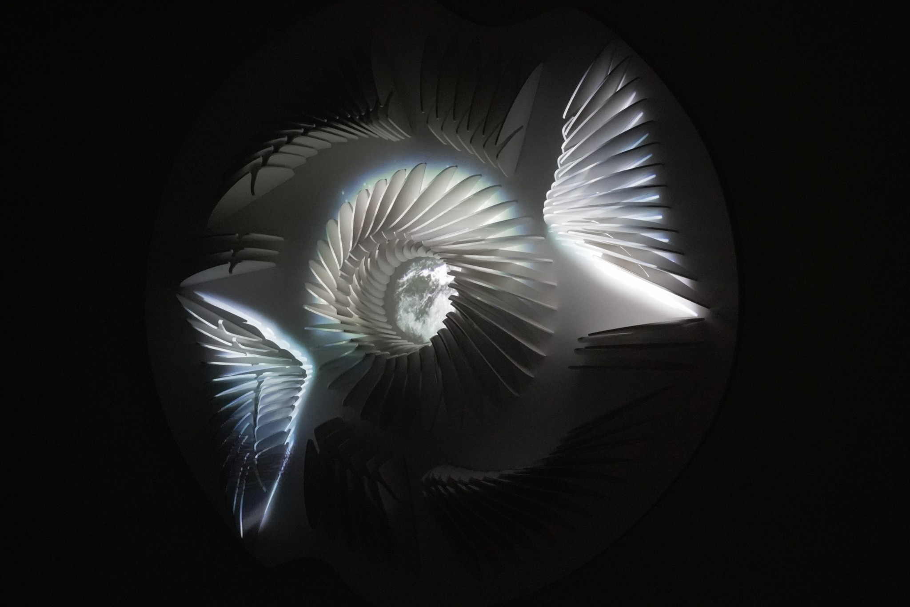
  
sources photo: https://www.facebook.com/creationsculpturevideo/?locale=mk_MK

## Description, intention et processus
Isochrone est une série de sculptures utilisant la projection de lumières et de vidéos, réalisées grâce à divers ateliers d'initiation aux arts numériques, au vidéo 
mapping,à la découpe laser sur le bois et au design paramétrique.

Les sculptures et leur mouvement circulaire sont générés par des formules mathématiques liées aux cercles et aux spirales. 

L'intention derrière cette œuvre est d'illustrer le processus naturel de la croissance des plantes en se basant sur la suite de Fibonacci, qui est une série de nombres 
exprimant la croissance des végétaux en forme spirale, comme les pépins de pommes et les écailles d'ananas, ainsi que sur le design paramétrique et la représentation artistique des plantes. 

Cette œuvre cible le public général, tant les enfants que les adultes. La sculpture, qui fait le portrait de la science et de l'art, a pour intention de démontrer 
le processus de croissance des plantes et sa beauté. Elle plonge le spectateur dans une immersion de couleurs lumineuses qui plaît autant aux enfants qu'aux adultes.

### Aspects Techniques
Bois, peinture acrylique, lecteur de fichier vidéo, projecteur vidéo .

  
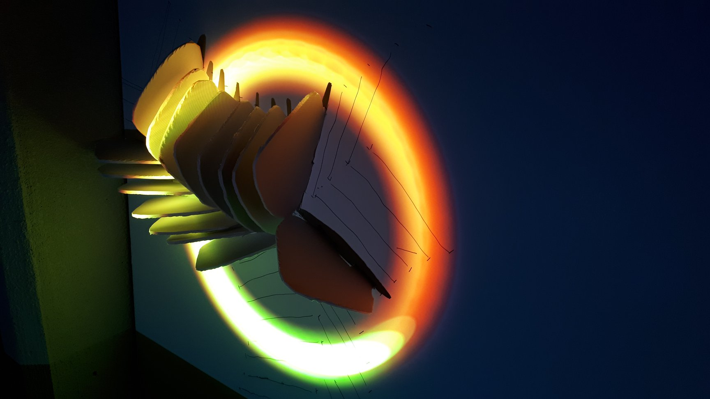  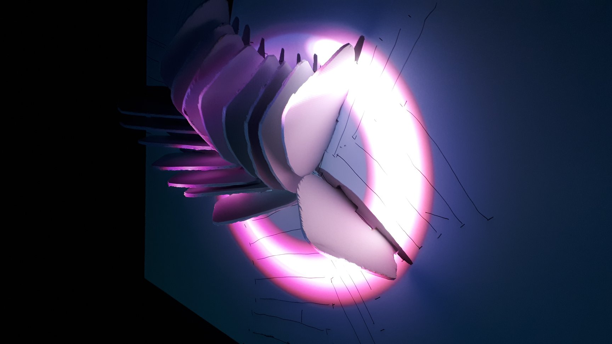
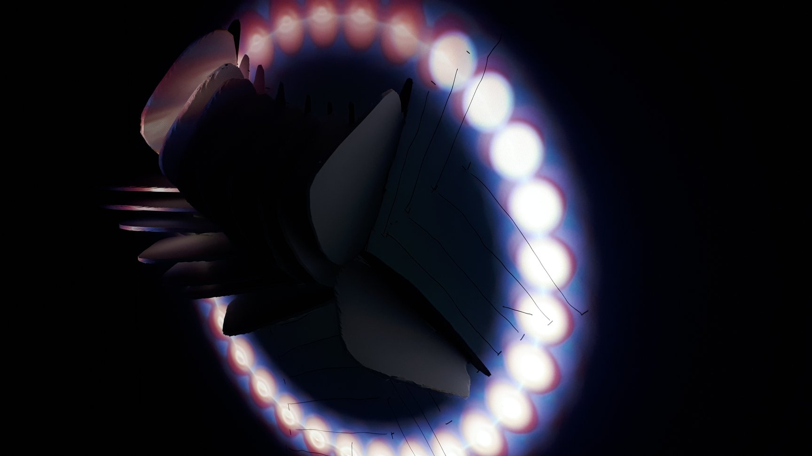  
 
sources photo: https://www.facebook.com/creationsculpturevideo/?locale=mk_MK

## Fonctionnement et composante de l'oeuvre
Le mouvement circulaire lumineux soutenu par la sculpture illustre la représentation artistique d’Emmanuel Chantre sur la croissance des plantes.

Cette représentation est réalisée à l’aide de mouvements circulaires lumineux générés par des formules mathématiques, immergeant le visiteur dans la croissance 
des plantes de manière artistique.

Cette composante centrale de l'œuvre crée une harmonie entre l'art numérique et traditionnel, tout en intégrant la science. Cela démontre les avancées dans le domaine 
des arts, mettant en lumière le mélange de la technologie et de l'art.

