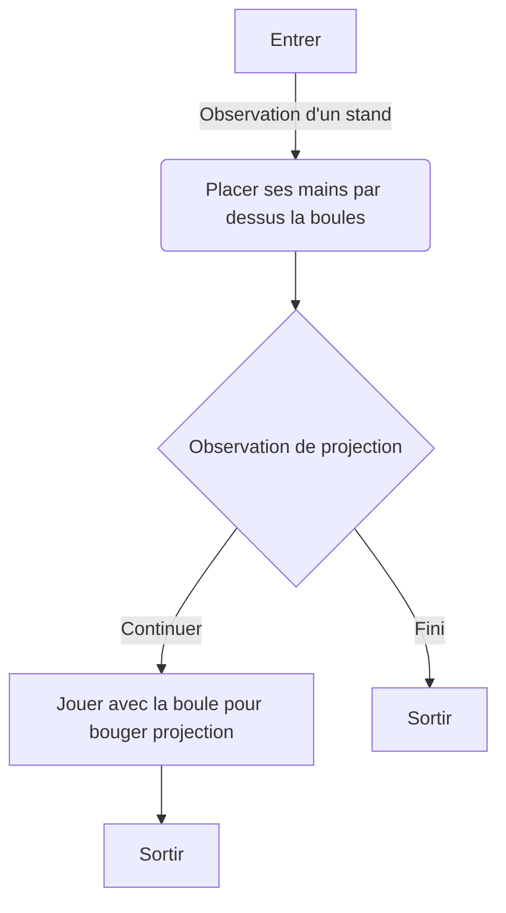

# Scénarisation intéractive - Sitmonternna Yi

## Idée générale
### Concept
Les visiteurs sont invités à poser leurs mains sur une boule interactive, où ils pourront observer une illustration générée par une intelligence artificielle, reflétant leur énergie. Les couleurs et les formes abstraites, également créées par l'IA, viendront enrichir cette expérience visuelle unique.

### Objectif
Ce projet vise à offrir aux visiteurs une interaction humaine enrichie par la technologie. Il s’agit également d’une activité conviviale pouvant rassembler de larges groupes, favorisant ainsi le renforcement des liens humains grâce à l’innovation technologique.

### Motivation créative
Ce projet a pour objectif de rassembler les proches tout en démontrant l'utilisation artistique de l'intelligence artificielle, accessible à tous, même à ceux qui n'ont aucune connaissance de cette technologie. Il cherche à dissiper les stéréotypes associés à l'IA, en montrant qu'elle peut enrichir les interactions humaines et favoriser des moments de partage et de connexion authentiques, même à l’ère numérique.

## Scénario intéractif
### Logigramme de l'intéractivité

 

### Narratif
Il n' y a pas de contexte narratif dans ce projet.

### Expérience intéractive
1. Installation de la Boule Interactif : Les participants sont invités à s'approcher d'une grande boule lumineuse. En plaçant leurs mains dessus, ils déclenchent une réponse visuelle unique.

2. Visualisation de l'Énergie : À mesure qu'ils interagissent avec la boule, une illustration dynamique générée par l’intelligence artificielle apparaît sur un écran nearby, représentant leur énergie sous forme de couleurs et de formes abstraites. Chaque interaction est différente, rendant chaque expérience personnelle et unique.

3. Partage et Discussion : Après avoir exploré l’illustration, les visiteurs sont encouragés à partager leurs ressentis avec les autres. Des espaces de discussion sont aménagés pour favoriser les échanges sur leurs expériences respectives.

Cette expérience immersive vise à démontrer que la technologie, loin de nous isoler, peut servir de pont pour des interactions humaines enrichissantes.

## Ambiance - moodboard
### Moodboard visuelle
### Moodboard sonore
### Références artistiques

## Éléments et technologies nécessaire
### Support médiatique
Description des types de médias (vidéo, audio, lumières, capteurs, etc.) et de leur intégration pour créer une expérience immersive.
### Matériel
Technologies interactives : Liste des technologies interactives employées (caméras, LIDAR, systèmes RFID, etc.) pour capter et analyser les actions du public en temps réel, permettant de déclencher des événements en réponse.

Plateformes et outils : Présentation matériels et interfaces interactives nécessaires au projet, comme des logiciels de projection, des systèmes de tracking ou des capteurs intelligents.

### Logiciels
Présentation des logiciels et des techniques employée pour réaliser le projet.

Réseautage et communication : Explication des systèmes de communication entre les différentes composantes (réseaux, protocoles de communication comme OSC ou MIDI, etc.).
